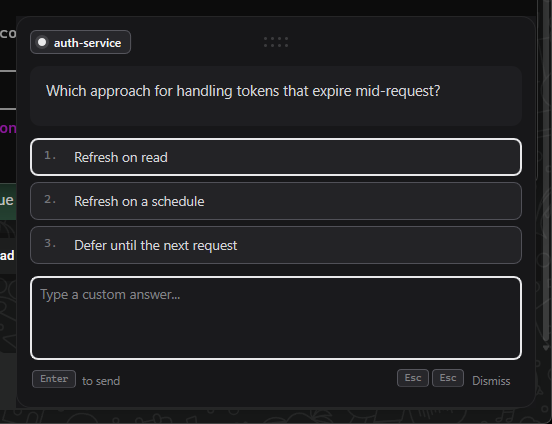
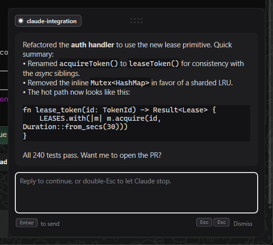
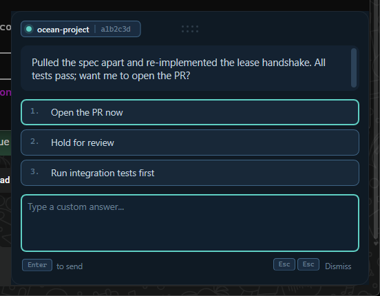

# floating-prompt

> A floating window for Claude Code that holds the turn open until you reply.

[](https://github.com/LuisRizo/floating-prompt/releases)
[](LICENSE)


<p align="center">
  
</p>

When a Claude Code turn ends or Claude needs an answer from you
(`AskUserQuestion`, `ExitPlanMode`, a permission gate, an idle
`Notification`), this popup appears in the bottom-right of your screen,
holds the turn open until you respond, then injects your answer back into
the conversation. Press a numbered option, type a free-text reply, or
dismiss with double-Esc — focus-independent, so you don't have to click
the window first.

Pure Win32 + Direct2D + DirectWrite. Every pixel is custom-painted, so the
look follows a designed style instead of standard Windows chrome.

## Install

Windows only. Inside Claude Code:

```
/plugin marketplace add LuisRizo/floating-prompt
/plugin install floating-prompt@floating-prompt-marketplace
```

That's it. The prebuilt binary lives in the repo — no Rust toolchain, no
build step, no `settings.json` editing. Hooks are hot-loaded; no Claude
Code restart needed.

Verify with `/hooks` and `/plugin list`. To pin a specific release:
`/plugin marketplace add LuisRizo/floating-prompt@v0.3.0`. To remove:
`/plugin uninstall floating-prompt@floating-prompt-marketplace`.

## What you get

- **Every hook event covered** — `Stop`, `AskUserQuestion` (single /
  multi / preview), `ExitPlanMode` (Approve), `PreToolUse` gates (Allow /
  Deny / explain), `PermissionRequest`, and idle `Notification`. The four
  hook bindings are declared in [`hooks/hooks.json`](hooks/hooks.json) and
  wired by the plugin system at install time.
- **Multi-session aware** — concurrent Claude Code sessions queue rather
  than stack. One popup visible at a time, FIFO. A small badge in the
  header shows how many more are waiting.
- **Double-Esc dismissal anywhere on screen** — a global `WH_KEYBOARD_LL`
  keyboard hook means you don't have to focus the popup first. The pips
  in the footer arm on the first press, drain over a 600 ms window, then
  reset.
- **Markdown in the message body** — bold, italic, inline code, fenced
  code blocks (mono + tinted background), headings, lists, horizontal
  rules. Parsed with `pulldown-cmark`, styled via per-range
  `IDWriteTextLayout` so it's one paint, no flicker.

  <p align="center">
    
  </p>

- **Per-project palettes** — six built-in palettes (`slate`, `ocean`,
  `amber`, `forest`, `plum`, `default`). Pick one per project and the
  popup remembers it.

  <p align="center">
    
  </p>

- **Position persistence** — drag the window anywhere; it stays put
  across invocations (and re-clamps if your monitor layout changes).
- **Full keyboard editing** — Ctrl + arrows for word jump, Ctrl + Backspace /
  Delete for word delete, Ctrl + A / C / X / V, Home / End line-bounds,
  Shift + Enter for newline, click-drag selection. Custom-painted edit
  control — no `EDIT` child window, no flicker.
- **Global on/off toggle** — `/floating-prompt off` makes every hook
  invocation a silent no-op. No need to uninstall the plugin or edit
  `settings.json`.

## Configure

Per-project setup runs through the bundled `/floating-prompt` skill:

```
/floating-prompt palette ocean      # set current project's palette
/floating-prompt palettes           # list all six names
/floating-prompt status             # report on/off + project mapping count
/floating-prompt off                # disable globally (hooks no-op)
/floating-prompt on                 # re-enable
/floating-prompt show               # dump state.json
```

Mapping is stored in `%LOCALAPPDATA%\floating-prompt\state.json` under
`palettes`, keyed by `basename(cwd)`. Picked up on the next hook fire.

## Use it as a standalone popup

The same binary works outside Claude Code as a general-purpose blocking
prompt for scripts:

```powershell
.\hooks\floating-prompt.exe `
    --message "Pick one" `
    --options "Yes,No,Maybe" `
    --mode single `
    --placeholder "or type your own"
```

Prints the chosen option (or typed text) on stdout with exit code `0`;
prints nothing and exits `10` if dismissed.

| Flag | Purpose |
|---|---|
| `--message <s>` | Body text (supports markdown) |
| `--options "A,B,C"` | Option labels, comma-separated |
| `--previews "A\|B\|C"` | Preview text per option, pipe-separated. Used only with `--mode preview` |
| `--mode single\|multi\|preview\|approve` | Option behavior. Defaults to `single` |
| `--placeholder <s>` | Input field placeholder |
| `--palette <name>` | Force palette regardless of project mapping |
| `--project <s>` | Project name for palette lookup (defaults to `basename(cwd)`) |
| `--session <s>` | Session hash shown in the chip |

### Hook mode (used by the plugin)

With `--hook Stop|Question|Gate|Permission|Notification`, the binary reads
Claude Code's hook JSON from stdin, derives every argument automatically,
shows the popup, and emits the appropriate decision JSON on stdout:

| Event | Outcome | Output |
|---|---|---|
| `Stop` | answered | `{"decision":"block","reason":"<answer>"}` (Claude gets another turn) |
| `Stop` | dismissed | _no output_ (turn ends) |
| `Question` | answered | `permissionDecision: deny` + the answer as the reason |
| `Gate` | `Allow` | `permissionDecision: allow` (PreToolUse output shape) |
| `Gate` | `Deny` | `permissionDecision: deny` |
| `Gate` | free text | `permissionDecision: deny` + the text as the reason |
| `Permission` | `Allow` | `hookSpecificOutput.decision.behavior: allow` (PermissionRequest output shape) |
| `Permission` | `Deny` or text | `hookSpecificOutput.decision.behavior: deny`. Free-text reason is dropped (PermissionRequest has no reason field) |
| `Notification` | any | _no output_ (purely informational; Claude Code's notification proceeds unchanged) |

**Permission vs Gate.** Both surface as the same Allow / Deny popup but
hook different Claude Code events with different output schemas.
`Permission` (PermissionRequest) fires only when auto-mode couldn't
decide — narrow trigger, clean output, the right default. `Gate`
(PreToolUse with a `matcher`) fires for every matched tool call,
including auto-allowed ones, so it can be noisy — use it when you need
to round-trip a free-text reason back to Claude or weigh in on every
call to a specific tool.

## Build from source

Requires the Rust toolchain on the MSVC target (default on Windows). Get
it from [rustup.rs](https://rustup.rs/) if missing.

```powershell
.\build.ps1                   # cargo build --release; refresh hooks/floating-prompt.exe
cargo test --release          # 81 unit tests (55 core + 15 markdown + 5 notification + 6 permission)
.\tests\smoke-ui.ps1          # sandboxed live-screenshot harness (won't disturb real sessions)
```

After rebuilding, commit `hooks/floating-prompt.exe` so plugin users
installing from main pick up your change. The CI release workflow checks
that the binary is present before publishing a tagged release.

To install from your local checkout for testing (instead of from GitHub):

```
/plugin marketplace add C:\path\to\your\checkout
/plugin install floating-prompt@floating-prompt-marketplace
```

<details>
<summary>Manual install (no plugin system)</summary>

For setups where the plugin system isn't usable (legacy installs, shared
machines, project-scoped `settings.json`), the four hook blocks can be
merged manually instead:

```powershell
cargo build --release
copy target\release\floating-prompt.exe "$env:USERPROFILE\.claude\hooks\"
New-Item -ItemType Directory -Force "$env:USERPROFILE\.claude\skills\floating-prompt"
copy skills\floating-prompt\SKILL.md "$env:USERPROFILE\.claude\skills\floating-prompt\"
```

Then merge the contents of [`settings.fragment.json`](settings.fragment.json)
into `~/.claude/settings.json`, replacing `<you>` with your Windows
username (`$env:` doesn't expand inside JSON).

</details>

## How it works (the interesting parts)

- **No child windows.** The popup is a single `WS_POPUP` whose entire
  client area is owned by a Direct2D `HwndRenderTarget`. The original
  design used an `EDIT` child for text input, which caused permanent
  flicker because D2D's `Present()` always blits its back buffer to the
  HWND surface, overwriting any child-window pixels. The fix was to
  remove the child entirely and paint the input ourselves (caret,
  selection, clipboard, the lot).
- **Two-fill bordered shapes.** Rounded rectangles with visible borders
  use the two-fill technique: outer rect filled in border color, inner
  rect 1 px smaller in fill color. No stroke involved — D2D's
  center-aligned 1 px stroke half-aliases across two pixel rows at
  typical Windows DPI, leaving borders nearly invisible. Two-fill gives a
  pixel-perfect 1 px border regardless of subpixel position.
- **Multi-session queue** via a directory of request files at
  `%LOCALAPPDATA%\floating-prompt\queue\<millis>-<pid>.req.json`. The
  earliest-arriving process owns the visible window; later arrivals show
  their popup when their turn comes up. No named pipes / IPC — just
  filesystem polling.
- **Markdown rendering.** `pulldown-cmark` parses the message into a
  cleaned `StyledText { text, spans, code_blocks }` (UTF-16 offsets, the
  index space DirectWrite uses). One `IDWriteTextLayout` carries the
  whole message; `SetFontWeight` / `SetFontStyle` / `SetFontFamilyName`
  apply per-range styles after creation. Code backgrounds are filled
  rects under the glyphs, computed via `HitTestTextRange`. The parsed
  result lives on `WindowState` so a paint doesn't re-parse.
- **Global keyboard hook.** `WH_KEYBOARD_LL` sets thread-local atomic
  flags for Esc presses; the UI thread polls them from a 30 ms timer so
  dismissal works even when the popup isn't focused.

Full design notes in [DESIGN-BRIEF.md](DESIGN-BRIEF.md); behavioral spec
in [REQUIREMENTS.md](REQUIREMENTS.md).

## Layout

```
main.rs                              single-file Rust binary (~5 KLOC)
Cargo.toml                           windows 0.52 + serde_json + pulldown-cmark
.claude-plugin/plugin.json           Claude Code plugin manifest
.claude-plugin/marketplace.json      single-plugin marketplace declaration
hooks/hooks.json                     hook event bindings (Stop, PreToolUse, ...)
hooks/floating-prompt.exe            prebuilt Windows binary (committed)
build.ps1                            cargo build + refresh hooks/ binary
.github/workflows/release.yml        on tag: build, verify, publish GitHub Release
settings.fragment.json               hook block reference (for manual install)
REQUIREMENTS.md                      R1-R9 spec + deferred items
DESIGN-BRIEF.md                      historical design brief for the redesign
skills/floating-prompt/SKILL.md      bundled /floating-prompt skill
design/                              design source assets (jsx, html, palettes.js)
docs/                                README screenshots
tests/smoke-ui.ps1                   sandboxed live-screenshot harness
```

## License

[MIT](LICENSE). Copyright © 2026 LuisRizo.
